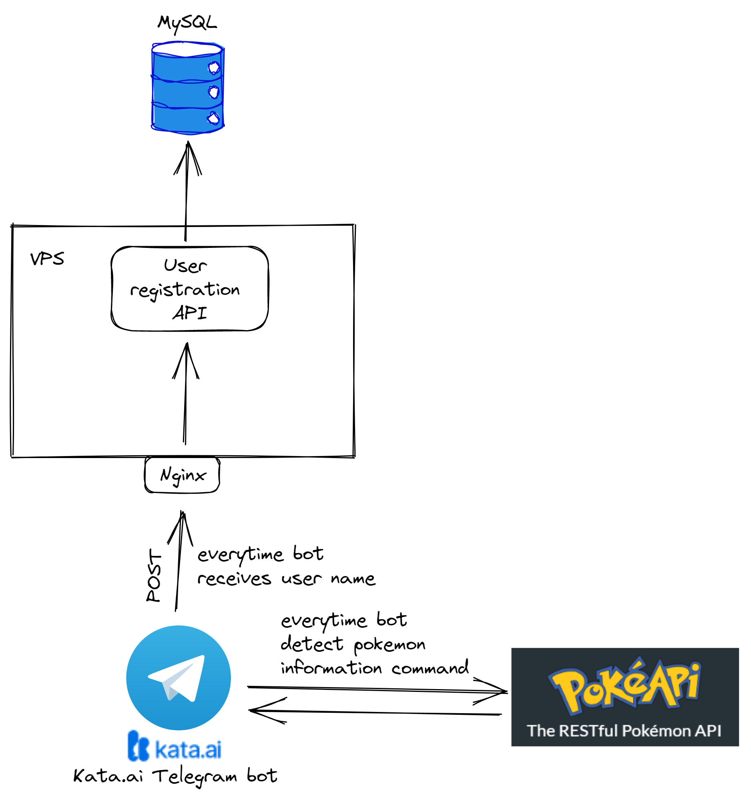

## Telegram Bot Pokemonfo
This is a Telegram Bot that can help you to find information about Pokemon. This bot is built using Node.js and Kata.ai platform. You can access this bot by clicking this link: https://t.me/pokemonfo_bot

## Setup Instructions

Follow the steps below to set up and run the API service on your local machine.

### 1. Clone the Repository

Clone this repository to your local machine using the following command:

git clone https://github.com/sultanfariz/pokemonfo.git

### 2. Install Dependencies

Navigate to the project directory and install the required dependencies using npm:

```
cd nodejs-api-service
npm install
```

### 3. Set Up the Database

Make sure you have a compatible database installed and running on your machine (e.g., MySQL, PostgreSQL).

Create a new database for the API service and note down the connection details.

### 4. Configure Database Connection

Open the `config.js` file located in the project root directory.

Replace the database configuration values with your own database connection details:

```javascript
module.exports = {
  database: {
    host: '<database_host>',
    port: '<database_port>',
    user: '<database_user>',
    password: '<database_password>',
    name: '<database_name>'
  },
  // Other configurations...
};
```
Save the changes.

### 5. Run the API Service
To start the API service, use the following command:
```npm start```
The API service will start running on the specified port (default: 3000).

### 6. Running with PM2 (Optional)
If you prefer to run the API service with PM2 process manager, follow these steps:
Install PM2 globally if you haven't already:
```npm install -g pm2```

Start the API service with PM2:
```pm2 start index.js --name api-service```

PM2 will automatically manage the Node.js process and keep it running even after system restarts.

## Diagram


## License
This project is licensed under the MIT License.